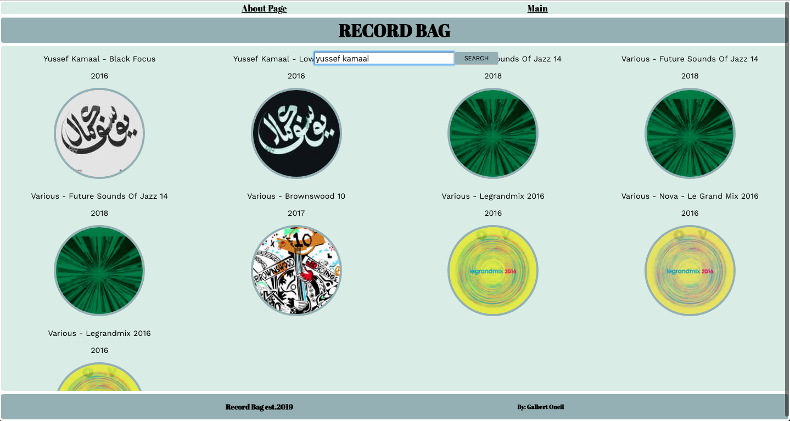

# RECORD BAG

# Project Description:
Record bag is a search engine that display a comprehensive list of the discographies of artists and bands.

# Wireframe:

# MVP / PostMVP:

# Component Heirarchy:
* App.js
* Nav.js
* Header.js
* Main.js(contain the functionality of the app)
* Search.js
* Albumdetail.js(Contain the about page)
* Footer.js

# Code Snippet:

# Issues and Resolutions:
* Issue:
1. Had a few issues trying to get the details of the albums to display on another component, tried different ways but none of then were successful.
* Resolution:
1. Due to the time factor wasn't able to add the feature to cick the album and get the information, for sure it will be ready for version 2.0

# Deployable link:
[heroku](https://recordbag-app.herokuapp.com/Main)
